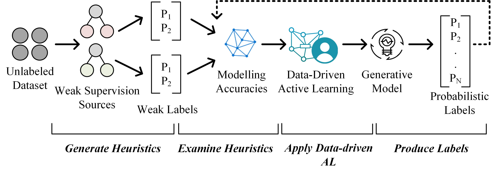

# Asterisk*
*Generating Training Data made Easy*

**Asterisk** is a framework to generate high-quality training datasets at scale. Instead of relying on the end users to write user-defined heuristics, the proposed approach exploits a small set of labeled data and automatically produces a set of heuristics to assign initial labels. In order to enhance the quality of the generated labels, the framework improves the accuracies of the heuristics by applying a novel data-driven AL process. During the process, the system examines the generated weak labels along with the modeled accuracies of the heuristics to help the learner decide on the points for which the user should provide true labels.

## Installation

To install Asterisk, you can use  `pip`:

    pip install asterisk
 or clone the Git repository and run:

    pip install -e .

within it.

## Publications

- M. Nashaat, A. Ghosh, J. Miller, and S. Quader, “Asterisk: Generating Large Training Datasets with Automatic Active Supervision,”  *ACM Transactions on Data Science (TDS)*, May 2020. 
- M. Nashaat, A. Ghosh, J. Miller, and S. Quader, "WeSAL: Applying Active Supervision to Find High-quality Labels at Industrial Scale", *Proceedings of the 53rd Hawaii International Conference on System Sciences*, HI, USA, 2020, pp. 219-228.
- M. Nashaat, A. Ghosh, J. Miller, S. Quader, C. Marston and J. Puget,    "Hybridization of Active Learning and Data Programming for Labeling Large Industrial Datasets,"  *2018 IEEE International Conference on Big Data (Big Data)* , Seattle, WA, USA, 2018, pp. 46-55. doi: 10.1109/BigData.2018.8622459.
